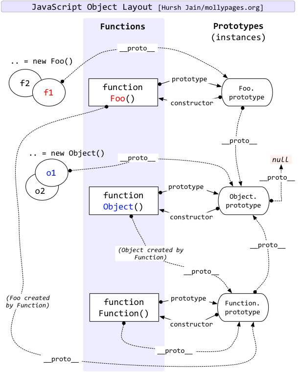

# 对象的原型与继承

## 原型

### 两种对象

在JavaScript中，对象又可以大致分为两类，**函数对象**和**普通对象**。
```js
const o = new Object(); // 普通对象
const f = new Function('arg','console.log(arg)'); // 函数对象
```
通过 `new Function()` 创建的都是函数对象，其余则是普通对象；普通对象是由 `new Object()` 创建的。
### 构造函数
```js
function Person(name) {
  this.name = name;
}
let p = new Person("路人甲");
```
通过`new`关键字调用的 `Person` 称为**构造函数**， `p` 为其一个实例；
### 关键属性

原型链主要依靠`prototype` 和 `__proto__` 和 `construct`三个属性实现。

- `prototype`是**函数对象**的一个属性，用于**指向原型对象**；
- `construct`是**原型对象**的一个属性，用于**指向构造函数**；
- `__proto__`是**所有对象**都有的一个属性，用于**指向创建该对象的构造函数的原型对象**。

**原型对象其实也是我们上面分类的一个普通对象。**

以上面的代码为例：

- 当我们新建一个`Person()`函数（**函数对象**）的时候，JavaScript 会帮我们为该函数预置一个`prototype`属性，该属性会指向`Person.prototype`（该函数的**原型对象**）；
- `Person.prototype`（原型对象）则会有一个`construct属性`用来指向`Person()`（构造函数）；
- 当我们新建一个`p`实例（**普通对象**）的时候，JavaScript也会帮我们预置一个属性`__proto__`（**隐式原型**），指向构造函数的原型对象，即`Person.prototype`。

### 原型链
由上面的结论，我们可以将`p`，`Person()`和`Person.prototype`串联起来，但是我们不要忘了，`Person.prototype`和`Person`也拥有`__proto__`属性，那么它们将指向哪里？

先扔一张图，看懂就毕业了。


其实很简单，前面我们说过，`Function()`是负责函数对象创建的构造函数，`Object()`是负责普通对象创建的构造函数，那么很显然，
- `Person()`是一个函数对象，所以它的`__proto__`指向它的构造函数`Function()`的原型对象`Function.prototype`;
- `Person.prototype`是一个普通对象，所以它的`__proto__`指向它的构造函数`Object()`的原型对象`Object.prototype`;

再往深一层看，我们已经知道了我们自己定义的各种对象之间的亲戚关系，那么JavaScript给我们提供的`Function()`和`Object()`之间的关系又是怎样？
套用我们前面的理论，从`Function()`开始：
- `Function()`是一个函数对象，所以它有`__proto__`和`prototype`两个属性，它的`__proto__`指向它的构造函数`Function()`的原型对象`Function.protootype`，而它的`prototype`指向`Function.protootype`；
- `Function.protootype`的`construct`指向它的构造函数`Function()`，`__proto__`指向它的构造函数`Object()`的原型对象`Object.prototype`；
- 绕了一圈绕到`Object`了，`Object()`是一个函数对象，所以它有`__proto__`和`prototype`两个属性，它的`__proto__`指向它的构造函数`Function()`的原型对象`Function.protootype`，而它的`prototype`指向`Object.protootype`；
- `Object.protootype`已经是所有对象的爹了，也没有`construct`属性了，它的`__proto__`指向了所有对象的爷爷`null`。

## 继承

继承是面向对象里面关键的一环，通过继承，我们可以将具有相似特性的对象抽象成一个类`Class`，实现代码的高度复用。JavaScript 中，我们通过`prototype`实现继承。
### 原型链继承
```js
// 父类
function SuperClass() {
  this.state = ["1"];
  this.say = function () {
    console.log(this.state);
  };
}

// 子类
function SubClass() {}

/* 关键 */
SubClass.prototype = new SuperClass();

const _super = new SuperClass();
const _sub1 = new SubClass();
const _sub2 = new SubClass();

/* 共享属性导致的引用类型问题 */
_sub1.say() // [ '1' ]
_sub1.state.push("2")
_sub2.say() // [ '1', '2' ]

console.log(_sub2.state === _sub1.state) // true
console.log(_sub1.__proto__ === _sub2.__proto__) // true
```
- **思路：将子类的原型对象`prototype`指向父类的实例，本质上是子类的实例在共享父类里面的属性。**
- **存在的问题：当我们有一个实例去修改了父类里面值为引用类型的属性时，会影响到其他所有实例的这个属性。**

### 借用构造函数继承
```js
// 父类
function SuperClass() {
  this.state = ["1"];
  this.say = function () {
    console.log(this.state);
  };
}

// 子类
function SubClass() {
  /* 关键 */
  SuperClass.call(this);
}

// SubClass.prototype = new SuperClass();

const _super = new SuperClass();
const _sub1 = new SubClass();
const _sub2 = new SubClass();

/* 不存在共享属性的问题 */
_sub1.say(); // [ '1' ]
_sub1.state.push("2");
_sub2.say(); // [ '1' ]
/* 方法未实现共享 */
console.log(_sub1.say === _sub2.say) // false

console.log(_sub2.state === _sub1.state); // false
console.log(_sub1.__proto__ === _sub2.__proto__); // true

```
- **思路：在实例化子类的时候，以子类的`this`借用父类的构造函数。通过这种方法，解决了原型链继承带来的子类共享父类引用属性的问题。**
- **缺陷：通过子类构造函数产生的对象产生的对象只是子类的实例；无法实现函数复用，每个子类都有父类实例函数的副本，影响性能。**

### 组合继承
结合原型链继承和借用构造函数继承的优点实现
```js
// 父类
function SuperClass() {
  this.state = ["1"];
}
/* 复用函数 */
SuperClass.prototype.say = function () {
  console.log(this.state);
};

// 子类
function SubClass() {
  /* 关键 */
  SuperClass.call(this);
}

/* 关键 */
// 修正子类的原型对象（第一次）
SubClass.prototype = new SuperClass();
console.log(SubClass.prototype.constructor); // SuperClass
// 修正子类的原型对象的构造函数
SubClass.prototype.constructor = SubClass;

const _super = new SuperClass();
const _sub1 = new SubClass();
const _sub2 = new SubClass();

/* 不存在共享属性的问题 */
_sub1.say(); // [ '1' ]
_sub1.state.push("2");
_sub2.say(); // [ '1' ]
/* 方法共享 */
console.log(_sub1.say === _sub2.say); // true
console.log(_sub2.state === _sub1.state); // false
console.log(_sub1.__proto__ === _sub2.__proto__); // true
```
**实现思路：**

- **通过原型链继承实现函数的复用；**
- **通过借用构造函数解决引用类型属性被共享的问题；**
- **要修改子类的原型对象；**
- **修改原型对象后会导致`constructor`指向改变，记得改。**

**同样的，这种方式也存在一个问题，就是父类的构造函数会被调用两次。**

### 寄生式继承
```js
// 父类
const SuperClass = {
  state: ["1"],
  say: function () {
    console.log(this.state);
  },
};

function createChild(original) {
  // const F = function () {};
  // F.prototype = original;
  // const clone = new F();
  const clone = Object.create(original);
  return clone;
}

const _sub1 = createChild(SuperClass);
const _sub2 = createChild(SuperClass);

/* 存在共享属性的问题 */
_sub1.say(); // [ '1' ]
_sub1.state.push("2");
_sub2.say(); // [ '1', '2' ]
/* 方法实现共享 */
console.log(_sub1.say === _sub2.say); // true

console.log(_sub2.state === _sub1.state); // true
console.log(_sub1.__proto__ === _sub2.__proto__); // true
console.log(_sub1.__proto__ === SuperClass); // true
```
**类似于工厂模式的方式，通过为子类实例指定`__proto__`的方式来创建对象；仍然是存在引用共享的问题。**

### 寄生组合式继承
```js
// 父类
function SuperClass() {
  this.state = ["1"];
}

SuperClass.prototype.say = function () {
  console.log(this.state);
};

// 子类
function SubClass() {
  SuperClass.call(this);
}

// SubClass.prototype = new SuperClass();
SubClass.prototype = Object.create(SuperClass.prototype);
SubClass.prototype.construct = SubClass;

const _sub1 = new SubClass();
const _sub2 = new SubClass();

/* 不存在共享属性的问题 */
_sub1.say(); // [ '1' ]
_sub1.state.push("2");
_sub2.say(); // [ '1' ]
/* 方法实现共享 */
console.log(_sub1.say === _sub2.say); // true

console.log(_sub1.__proto__ === _sub2.__proto__); // true
console.log(_sub1.__proto__ === SuperClass); // false
```
**集百家之长，综合上面所有套路。**

- **通过原型继承解决函数复用问题；**
- **通过借用构造函数解决引用属性共享问题；**
- **通过`Object.create()`解决重复调用父类构造函数问题。**

### ES6继承

我们可以用 `babel` 去编译我们的 ES6 代码，了解实现的思路；比如，如下 ES6 代码：

```js
class SuperClass {
  constructor() {
    this.state = ["1"];
  }
  say() {
    console.log(this.state);
  }
  static method() {}
}

class SubClass extends SuperClass {
  constructor() {
    super();
  }
}

const _sub1 = new SubClass();
const _sub2 = new SubClass();

/* 不存在共享属性的问题 */
_sub1.say(); // [ '1' ]
_sub1.state.push("2");
_sub2.say(); // [ '1' ]
/* 方法实现共享 */
console.log(_sub1.say === _sub2.say); // true

console.log(_sub1.__proto__ === _sub2.__proto__); // true
console.log(_sub1.__proto__ === SuperClass); // false

```

通过使用 `Babel` 进行编译，可以得到：

```js
/* 核心，为子类安排三件套 */
function _inheritsLoose(subClass, superClass) {
  // 原型继承
  subClass.prototype = Object.create(superClass.prototype);
  subClass.prototype.constructor = subClass;
  subClass.__proto__ = superClass;
}

var SuperClass = (function () {
  function SuperClass() {
    this.state = ["1"];
  }
  var _proto = SuperClass.prototype;
  // 绑定内部方法
  _proto.say = function say() {
    console.log(this.state);
  };
  // 绑定静态方法
  SuperClass.method = function method() {};
  return SuperClass;
})();

var SubClass = (function (_SuperClass) {
  _inheritsLoose(SubClass, _SuperClass);
  function SubClass() {
    // 借用构造函数
    return _SuperClass.call(this) || this;
  }
  return SubClass;
})(SuperClass);

var _sub1 = new SubClass();
var _sub2 = new SubClass();
/* 不存在共享属性的问题 */
_sub1.say(); // [ '1' ]
_sub1.state.push("2");
_sub2.say(); // [ '1' ]

/* 方法实现共享 */
console.log(_sub1.say === _sub2.say); // true
console.log(_sub1.__proto__ === _sub2.__proto__); // true
console.log(_sub1.__proto__ === SuperClass); // false
```

完完全全就是一个寄生组合式继承。

## 参考

- 《JavaScript高级程序设计》

- [You-Dont-Know-JS / this & object prototypes](https://github.com/getify/You-Dont-Know-JS/tree/1ed-zh-CN/this%20%26%20object%20prototypes)