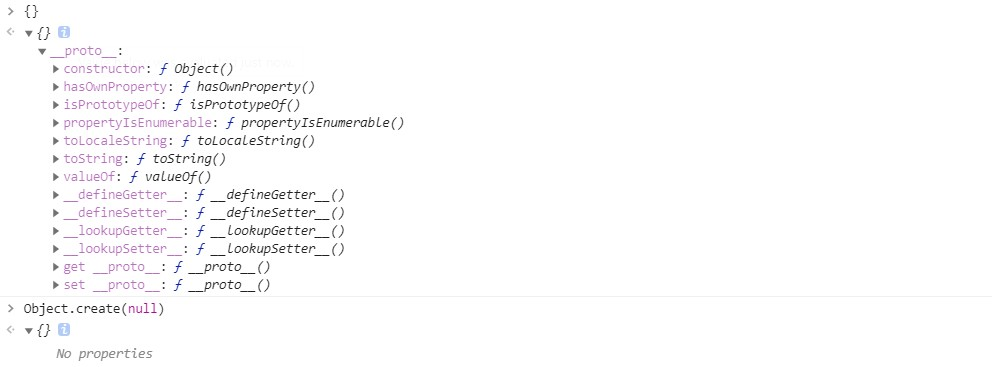

# 对象

## 对象的属性

在 ECMA-262 中，对象被定义为一个无序属性的集合，其属性可以包含基本值、对象或者函数。通常我们可以通过字面量或者构造函数的方式创建一个对象：

```js
//字面量
const o1 = {};
o1.name = "o1";
console.log(o1); //{ name: 'o1' }
//构造函数
const o2 = new Object();
o2.name = "o2";
console.log(o2); //{ name: 'o2' }
```

**JavaScript 在创建对象的属性时，会带有一些用于描述其行为的特征值，这些属性因为其特征值的不同分为两类：数据属性和访问器属性。**

### 数据属性

数据属性又包括 4 个特征值：

- `[[Configurable]]`：表示能否通过 `delete` 删除属性，能否修改属性特性，能否把属性修改为访问器属性，默认为 `true` 。
- `[[Enumerable]]`：表示能否通过 `for-in` 循环返回属性，默认为 `true` 。
- `[[Writable]]`： 表示能否修改属性的值，默认为 `true`。
- `[[value]]`：属性的数据值，读取属性值的时候从这个位置读，写入属性值的时候，从这个位置写，默认为 `undefined` 。

### 访问器属性

访问器属性也包括 4 个特征值：

- `[[Configurable]]`：表示能否通过 `delete` 删除属性，能否修改属性特性，能否把属性修改为数据器属性，默认为 `true` 。
- `[[Enumerable]]`：表示能否通过 `for-in` 循环返回属性，默认为`true`。
- `[[Get]]`：在读取属性时调用的函数，默认为 `undefined` 。
- `[[Set]]`：在写入属性时调用的函数，默认为 `undefined` 。

**注意：将 `configurable` 设置为 `false` 是一个单向操作，不可撤销！**

## 对象的值

在访问对象的值的时候，引擎实际上会调用内部默认的 `[[Get]]` 操作，在设置值时调用 `[[Put]]` 操作。

### [ [ Get ] ]

1. 直接在对象上查找属性，如果没有找到就会去遍历 `[[Prototype]]` 链，如果没有找到属性则返回 `undefined`。
2. 判断该属性是否为访问器属性，如果是且 `[[Getter]]` 存在，就调用 `[[Getter]]`。
3. 正常读取值。

### [ [ Put ] ]

1. 判断该属性是否为访问器属性，如果是且 `[[Setter]]` 存在，就调用 `[[Setter]]`。
2. 判断该属性是否为`writable` 为 `false` 的数据属性，如果是，在非 `strict mode` 下无声地失败，或者在 `strict mode` 下抛出 `TypeError`。
3. 正常设置值。

## 对象的创建

一般情况下，对象都是通过以下两者方式创建的。

```js
const obj1 = {}; // 字面量
const obj2 = new Object(); // 构造函数
```

### Object.create()

除了这两种方式，JavaScript 还提供了一个 `Object.create()` 方法用于创建对象，使用该方法可以创建一个新对象，并使用现有的对象来提供新创建的对象的**proto**。

- Object.create(proto,[propertiesObject]) 方法接受两个参数：
  - proto：新创建对象的原型对象。
  - propertiesObject（可选）：要添加到新对象的可枚举（新添加的属性是其自身的属性，而不是其原型链上的属性）的属性。

```js
const Component = {
  render() {
    console.log("render");
  },
};

const input = Object.create(Component, {
  name: {
    writable: true,
    configurable: true,
    value: "Input",
  },
});

input.render(); // render
console.log(input.__proto__ === Component); // true
```

如上述例子，我们在 `input` 对象上添加了一个 `name` 数据属性，并且自身的 `__proto__` 也指向了我们传入的 `Component` 对象。

### Object.create(null) 与 {}

在一些库源码中，时常能够遇见作者使用 `Object.create(null)` 去初始化一个空对象，那么这种方式与直接使用 `{}` 有什么区别呢？

我们可以在 chrome 的控制台中打印出来，进行比较：



可以看到，使用 `{}` 创建的对象的 `__proto__` 属性指向 `Object`，所以可以通过原型链访问 `Object.prototype` 上的属性和方法，而 `Object.create(null)` 创建的对象是一个 “非常纯净” 的对象，不会被一些继承来的属性所影响，适合当作一些数据的存储字典。

### Object.fromEntries()

通过 为`Object.fromEntries()` 传入一个可迭代的键值对列表参数，即可创建一个新的对象。

```js
const entries = [
  ["id", 123],
  ["name", "xiaoming"],
];

const xiaoming = Object.fromEntries(entries);
console.log(xiaoming); // { id: 123, name: 'xiaoming' }
```

## 对象的解构

最常见的对象解构方式，定义一个新变量并使用对象内的值作为变量的初始值。

```js
const person = {
  name: "xiaoming",
  detail: {
    level: 15,
  },
};

const { name } = person;
const { name: personName } = person;
const {
  detail: { level },
} = person;

console.log(name); // xiaoming
console.log(personName); // xiaoming
console.log(level); // 15
```

解构的时候还可以给与一个默认值。

```js
const res = {};
const { msg = "默认值" } = res;
console.log(msg); // 默认值
```

使用解构，还可以为其他对象赋值

```js
const data = {
  name: "foo",
};
const copyData = {};
({ name: copyData.copyName } = data);
console.log(copyData.copyName); // foo
```

## 对象内容的修改

- `Object.defineProperties()` 方法直接在一个对象上定义新的属性或修改现有属性，并返回该对象。
- `Object.defineProperty()` 方法会直接在一个对象上定义一个新属性，或者修改一个对象的现有属性，并返回此对象。
- `Object.setPrototypeOf()` 方法设置一个指定的对象的原型到另一个对象或 `null`。

## 对象内容的获取

- `Object.getOwnPropertyDescriptor()` 方法返回指定对象上一个自有属性对应的属性描述符。（自有属性指的是直接赋予该对象的属性，不需要从原型链上进行查找的属性）
- `Object.getOwnPropertyDescriptors()` 方法用来获取一个对象的所有自身属性的描述符。
- `Object.getOwnPropertyNames()` 方法返回一个由指定对象的所有自身属性的属性名（包括不可枚举属性但不包括 Symbol 值作为名称的属性）组成的数组。
- `Object.getOwnPropertySymbols()` 方法返回一个给定对象自身的所有 Symbol 属性的数组。
- `Object.getPrototypeOf()` 方法返回指定对象的原型（内部[[Prototype]]属性的值）。
- `Object.prototype.toString()`
- `Object.prototype.valueOf()`
- `toLocaleString()` 方法返回一个该对象的字符串表示。此方法被用于派生对象为了特定语言环境的目的（locale-specific purposes）而重载使用。
- `Object.entries()` 方法返回一个给定对象自身可枚举属性的键值对数组，其排列与使用 `for...in` 循环遍历该对象时返回的顺序一致（区别在于 `for-in` 循环还会枚举原型链中的属性）。

## 对象的判断

- `Object.is()` 方法判断两个值是否为同一个值。
- `Object.isExtensible()` 方法判断一个对象是否是可扩展的（是否可以在它上面添加新的属性）。
- `Object.isFrozen()` 方法判断一个对象是否被冻结。
- `Object.isSealed()` 方法判断一个对象是否被密封。
- `Object.prototype.isPrototypeOf()` 方法用于测试一个对象是否存在于另一个对象的原型链上。
- `Object.prototype.propertyIsEnumerable()` 方法返回一个布尔值，表示指定的属性是否可枚举。
- `in` 关键字，会把原型链上的属性也纳入考虑范围。
- `Object.prototype.hasOwnProperty()` 方法会返回一个布尔值，指示对象自身属性中是否具有指定的属性。

```js
const Component = function() {
  this.uid = 0;
};

const Form = function() {};

Form.prototype = new Component();

const input = new Form();

console.log("uid" in input); // true
console.log(Object.prototype.hasOwnProperty.call(input, "uid")); // false
```

**需要注意：`in` 关键字会把原型链上的属性也纳入考虑范围，而 `Object.prototype.hasOwnProperty()` 则只会考虑对象本身。**

## 限制对象的行为

- 防止对象的扩展： `Object.preventExtensions()` ，可以阻止一个对象被添加新的属性。
- 封印：`Object.seal()` ，让一个对象不仅不能够添加新的属性，而且不能修改属性的特征值和使用 `delete` 操作，相当于调用了 `Object.preventExtensions()` 并将 `[[Configurable]]` 设为了 `false`。
- 冻结：`Object.freeze()` ，相当于调用了 `Object.seal()` 并将 `[[Writable]]` 设为了 `false`。

## 对象的遍历

- `Object.values()` 方法返回一个给定对象自身的所有可枚举属性值的数组，值的顺序与使用 `for...in` 循环的顺序相同 ( 区别在于 `for-in` 循环枚举原型链中的属性 )。
- `Object.keys()` 方法会返回一个由一个给定对象的自身可枚举属性组成的数组，数组中属性名的排列顺序和正常循环遍历该对象时返回的顺序一致 。
- `for...in` 语句，通过 `key` 遍历对象，**会遍历原型链上的属性**。

结合 `Object.entries()` 方法也可以使用 `for...of` 语句遍历对象。

```js
const obj = {
  key1: 1,
  key2: 2,
  key3: 3,
};

const entries = Object.entries(obj); // [ [ 'key1', 1 ], [ 'key2', 2 ], [ 'key3', 3 ] ]

for (const [key, value] of entries) {
  console.log(`The value of ${key} is ${value}.`);
}
```

## 对象的拷贝

由于引用类型的存在，对象的拷贝可以分为浅拷贝和深拷贝。

- 浅拷贝：创建一个新对象，该对象引用被拷贝对象的所有属性，如果被拷贝对象的属性值是原始类型，则会直接拷贝值，如果是引用类型，则会拷贝内存地址。
- 深拷贝：与浅拷贝不同，当被拷贝对象的属性值是引用类型时，需要在内存中开辟一个新的地址去存储被拷贝的引用值。

### 浅拷贝

我们可以对源对象进行遍历，并将源对象的键值对直接赋值给新对象完成浅拷贝，也可以使用 `Object.assign()` 可以进行浅拷贝。

```js
const person = {
  name: "xiaoming",
};

Object.assign(person); // { name: 'xiaoming' }
```

### 深拷贝

要实现一个完整的深拷贝需要注意的点就非常多了，主要问题集中在：

- 循环引用
- 可迭代引用类型的拷贝
- 不可迭代引用类型的拷贝

具体可以参考：[如何写出一个惊艳面试官的深拷贝](http://www.conardli.top/blog/article/JS%E8%BF%9B%E9%98%B6/%E5%A6%82%E4%BD%95%E5%86%99%E5%87%BA%E4%B8%80%E4%B8%AA%E6%83%8A%E8%89%B3%E9%9D%A2%E8%AF%95%E5%AE%98%E7%9A%84%E6%B7%B1%E6%8B%B7%E8%B4%9D.html)

## 对象的代理

ES6 新增的 `Proxy` 为开发者提供了元编程的能力，让开发者可以对对象的默认行为通过编程进行控制。

`Proxy` 的语法如下：

```js
const p = new Proxy(target, handler);
```

包含两个参数：

- target：要使用 Proxy 包装的目标对象（可以是任何类型的对象，包括原生数组，函数，甚至另一个代理）。
- handler：一个通常以函数作为属性的对象，各属性中的函数分别定义了在执行各种操作时代理 p 的行为。

### 代理支持的拦截操作

Proxy 一共支持以下 13 种拦截操作：

- `get(target, propKey, receiver)`：拦截对象属性的读取，比如 proxy.foo 和 proxy['foo']。
- `set(target, propKey, value, receiver)`：拦截对象属性的设置，比如 proxy.foo = v 或 proxy['foo'] = v，返回一个布尔值。
- `has(target, propKey)`：拦截 propKey in proxy 的操作，返回一个布尔值。
- `deleteProperty(target, propKey)`：拦截 delete proxy[propKey]的操作，返回一个布尔值。
- `ownKeys(target)`：拦截 Object.getOwnPropertyNames(proxy)、Object.getOwnPropertySymbols(proxy)、Object.keys(proxy)、for...in 循环，返回一个数组。该方法返回目标对象所有自身的属性的属性名，而 Object.keys()的返回结果仅包括目标对象自身的可遍历属性。
- `getOwnPropertyDescriptor(target, propKey)`：拦截 Object.getOwnPropertyDescriptor(proxy, propKey)，返回属性的描述对象。
- `defineProperty(target, propKey, propDesc)`：拦截 Object.defineProperty(proxy, propKey, propDesc）、Object.defineProperties(proxy, propDescs)，返回一个布尔值。
- `preventExtensions(target)`：拦截 Object.preventExtensions(proxy)，返回一个布尔值。
- `getPrototypeOf(target)`：拦截 Object.getPrototypeOf(proxy)，返回一个对象。
- `isExtensible(target)`：拦截 Object.isExtensible(proxy)，返回一个布尔值。
- `setPrototypeOf(target, proto)`：拦截 Object.setPrototypeOf(proxy, proto)，返回一个布尔值。如果目标对象是函数，那么还有两种额外操作可以拦截。
- `apply(target, object, args)`：拦截 Proxy 实例作为函数调用的操作，比如 proxy(...args)、proxy.call(object, ...args)、proxy.apply(...)。
- `construct(target, args)`：拦截 Proxy 实例作为构造函数调用的操作，比如 new proxy(...args)。

### 代理的撤销

Proxy 也暴露了 `revocable()` 方法，这个方法支持撤销代理对象与目标对象的关联。撤销代理的操作是不可逆的。而且，撤销函数 `revoke()` 是幂等的，调用多少次的结果都一样。撤销代理之后再调用代理会抛出 TypeError。

```js
const target = {
  foo: "bar",
};

const handler = {
  get() {
    return "intercepted";
  },
};

// 返回代理对象 proxy 和撤销函数 revoke
const { proxy, revoke } = Proxy.revocable(target, handler);

console.log(proxy.foo); // intercepted
console.log(target.foo); // bar

revoke();

console.log(proxy.foo); // TypeError
```

### 代理的 this

Proxy 代理的情况下，目标对象的 this 会指向 Proxy 代理，而不是目标对象，例如：

```js
const target = {
  getThis() {
    return this;
  },
};

const handler = {};

const proxy = new Proxy(target, handler);

console.log(target.getThis() === target); // true
console.log(proxy.getThis() === proxy); // true
```

这种行为可能会导致一些问题：

```js
const target = new Date();
const handler = {};
const proxy = new Proxy(target, handler);

proxy.getDate(); // TypeError: this is not a Date object.
```

因为 getDate() 方法只能在 Date 对象实例上面拿到，如果 this 不是 Date 对象实例就会报错。

## 对象的反射 Reflect

## 参考

- [MDN](https://developer.mozilla.org/zh-CN/)
- [JavaScript 高级程序设计（第 4 版）](https://www.ituring.com.cn/book/2472)
- [ECMAScript 6 入门](https://es6.ruanyifeng.com/#docs/proxy)
