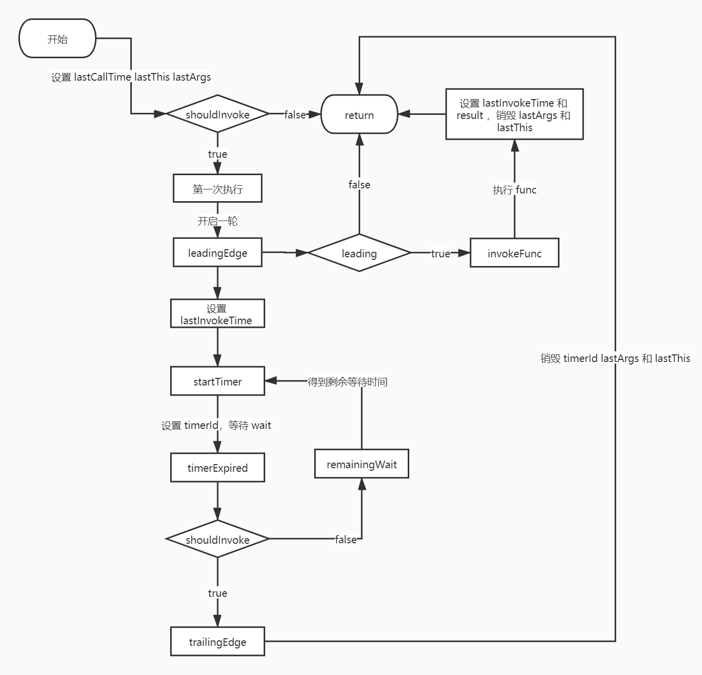

# 工具函数

## 防抖和节流

### 防抖

创建一个 debounced（防抖动）函数，该函数会从上一次被调用后，延迟 wait 毫秒后调用 func 方法。

```js
function debounce(func, wait = 1000) {
  let timerId;
  return function (...args) {
    let self = this;
    clearTimeout(timerId);
    timerId = setTimeout(function () {
      func.apply(self, args);
    }, wait);
  };
}
```

### 节流

创建一个节流函数，除了首次调用之外，其余时候在 wait 秒内最多执行 func 一次。

```js
function throttle(func, wait = 1000) {
  let lastTime;
  return function () {
    const curTime = Date.now();
    if (!lastTime || curTime - lastTime >= wait) {
      lastTime = curTime;
      return func();
    }
  };
}
```

### lodash 版

在 lodash 中，防抖和节流都是使用一个函数来进行实现，并且在满足一定条件的时候会优先使用 requestAnimationFrame 对 setTimeout 进行替代。

```js
function isObject(value) {
  const type = typeof value;
  return value != null && (type === "object" || type === "function");
}

function debounce(func, wait, options) {
  const root = window;

  let lastArgs, lastThis, maxWait, result, timerId, lastCallTime;

  let lastInvokeTime = 0;
  let leading = false;
  let maxing = false;
  let trailing = true;

  const useRAF =
    !wait && wait !== 0 && typeof root.requestAnimationFrame === "function";

  if (typeof func !== "function") {
    throw new TypeError("Expected a function");
  }

  wait = +wait || 0;
  if (isObject(options)) {
    leading = !!options.leading;
    maxing = "maxWait" in options;
    maxWait = maxing ? Math.max(+options.maxWait || 0, wait) : maxWait;
    trailing = "trailing" in options ? !!options.trailing : trailing;
  }

  // 计算剩余时间
  function remainingWait(time) {
    const timeSinceLastCall = time - lastCallTime;
    const timeSinceLastInvoke = time - lastInvokeTime;
    const timeWaiting = wait - timeSinceLastCall;

    return maxing
      ? Math.min(timeWaiting, maxWait - timeSinceLastInvoke)
      : timeWaiting;
  }

  // 判断是否需要执行 func
  function shouldInvoke(time) {
    const timeSinceLastCall = time - lastCallTime; // 距离上一次 func 调用
    const timeSinceLastInvoke = time - lastInvokeTime; // 距离上一轮 debounced 结束
    // Either this is the first call, activity has stopped and we're at the
    // trailing edge, the system time has gone backwards and we're treating
    // it as the trailing edge, or we've hit the `maxWait` limit.
    // 执行 func 需要满足以下其中一个条件
    return (
      lastCallTime === undefined || // 第一次调用
      timeSinceLastCall >= wait || // 距离上一次调用超过 wait
      timeSinceLastCall < 0 || // 系统时间倒退
      (maxing && timeSinceLastInvoke >= maxWait) // 距离上一轮 debounced 结束超过 maxWait
    );
  }

  // 执行 func
  function invokeFunc(time) {
    const args = lastArgs;
    const thisArg = lastThis;

    lastArgs = lastThis = undefined;
    lastInvokeTime = time;
    result = func.apply(thisArg, args);
    return result;
  }

  // timer 创建前
  function leadingEdge(time) {
    // Reset any `maxWait` timer.
    lastInvokeTime = time;
    // Start the timer for the trailing edge.
    timerId = startTimer(timerExpired, wait);
    // Invoke the leading edge.
    return leading ? invokeFunc(time) : result;
  }

  // timer 创建
  function startTimer(pendingFunc, wait) {
    if (useRAF) {
      root.cancelAnimationFrame(timerId);
      return root.requestAnimationFrame(pendingFunc);
    }
    return setTimeout(pendingFunc, wait);
  }

  // timer 销毁前
  function timerExpired() {
    const time = Date.now();
    if (shouldInvoke(time)) {
      return trailingEdge(time);
    }
    // Restart the timer.
    timerId = startTimer(timerExpired, remainingWait(time));
  }

  // timer 销毁
  function trailingEdge(time) {
    timerId = undefined;

    // Only invoke if we have `lastArgs` which means `func` has been
    // debounced at least once.
    if (trailing && lastArgs) {
      return invokeFunc(time);
    }
    lastArgs = lastThis = undefined;
    return result;
  }

  function debounced(...args) {
    const time = Date.now();
    const isInvoking = shouldInvoke(time);

    lastArgs = args;
    lastThis = this;
    lastCallTime = time;

    if (isInvoking) {
      if (timerId === undefined) {
        return leadingEdge(lastCallTime);
      }
      if (maxing) {
        // Handle invocations in a tight loop.
        timerId = startTimer(timerExpired, wait);
        return invokeFunc(lastCallTime);
      }
    }

    if (timerId === undefined) {
      timerId = startTimer(timerExpired, wait);
    }

    return result;
  }

  return debounced;
}
```

对于 `lodash` 的实现，我们可以理解为一次 `debounce()` 函数的执行为一个生命周期，生命周期被划分为了以下几个阶段：
- timer 创建前：对应 leadingEdge()，记录上一次调用 func 的时间 （lastInvokeTime），并判断 leading ，如果为 true 则会执行 func 并得到这一轮的结果，否则 return 上一轮的结果
- timer 的创建：对应 startTimer()，如果**未设置 wait 时间且 requestAnimationFrame 可用**，则选用 requestAnimationFrame，否则选用 setTimeout 。
- timer 销毁前：对应 timerExpired()，在 timer 等待 wait 之后，判断是否要进入下一阶段 ，不需要则重置 timer 并回到 timer 的创建。
- timer 销毁：对应 trailingEdge()，重置 timer 。

大致流程可以参考下图：



只需要将 maxWait 设置为 wait，防抖就变节流了。

```js
function throttle(func, wait, options) {
  let leading = true;
  let trailing = true;

  if (typeof func !== "function") {
    throw new TypeError("Expected a function");
  }
  if (isObject(options)) {
    leading = "leading" in options ? !!options.leading : leading;
    trailing = "trailing" in options ? !!options.trailing : trailing;
  }
  return debounce(func, wait, {
    leading,
    trailing,
    maxWait: wait,
  });
}
```

## 截取 URL 参数

```js
function getParameterFromUrlByRegExp(url) {
  if (!typeof url === "string") return;
  const res = {};
  url
    .substring(url.indexOf("?") + 1)
    .replace(/([^?&=]+)=([^&]+)/g, (_, key, value) => (res[key] = value));
  return res;
}
```

**正则版**

```js
function getParameterFromUrl(url) {
  if (!typeof url === "string") return;
  const res = {};
  const parameterList = url.substring(url.indexOf("?") + 1).split("&");
  for (const value of parameterList) {
    const tmp = value.split("=");
    res[tmp[0]] = tmp[1];
  }
  return res;
}
```

## 数组去重

**利用 Set()**

```js
function uniq(array) {
  return [...new Set(array)];
}
```

**lodash版**

```js
const HASH_UNDEFINED = "__lodash_hash_undefined__";

function uniq(array) {
  let index = -1;

  const { length } = array;
  const result = [];

  if (length >= 200) {
    let seen = new Map();
    while (++index < length) {
      let value = array[index];
      value = value !== 0 ? value : 0;
      if (!seen.has(value)) {
        seen.set(value, HASH_UNDEFINED);
        result.push(value);
      }
    }
  } else {
    let seen = result;
    outer: while (++index < length) {
      let value = array[index];
      value = value !== 0 ? value : 0;
      let seenIndex = seen.length;
      while (seenIndex--) {
        if (seen[seenIndex] === value) {
          continue outer;
        }
      }
      result.push(value);
    }
  }
  return result;
}
```
- 对于长度小于 200 的数组，采用两个数组进行存储，一个暂存已经出现的值，一个作为结果返回，两层循环遍历。
- 对于长度大于 200 的数组，暂存数组会改用 `lodash` 内部的 Hash 替代，上述实现则改用 ES6 的 `Map` 进行替代。

## 对象深拷贝

## 数组扁平化

### 深度为 1

**loadsh 版**

```js
function flatten(array) {
  const result = [];
  if (array == null) {
    return result;
  }
  for (const value of array) {
    if (Array.isArray(value)) {
      result.push(...value);
    } else {
      result[result.length] = value;
    }
  }
  return result;
}
```

### 深度大于 1

**lodash 版**

```js
function flattenDeep(array, depth = Infinity, result = []) {
  if (array == null) {
    return result;
  }
  for (const value of array) {
    if (depth && Array.isArray(value)) {
      if (depth > 1) {
        flattenDeep(value, depth - 1, result);
      } else {
        result.push(...value);
      }
    } else {
      result[result.length] = value;
    }
  }
  return result;
}
```

**reduce 装x版**

```js
function flattenDeep(arr) {
  return Array.isArray(arr)
    ? arr.reduce((a, b) => [...flattenDeep(a), ...flattenDeep(b)], [])
    : [arr];
}
```

## 时间

## 参考

- [lodash](https://www.lodashjs.com/)
- [lodash 源码](https://github.com/lodash/lodash)
- [探究防抖(debounce)和节流(throttle) - Bowen7](https://github.com/Bowen7/Blog/issues/5)
- [lodash源码分析 - yeyuqiudeng ](https://yeyuqiudeng.gitbooks.io/pocket-lodash)