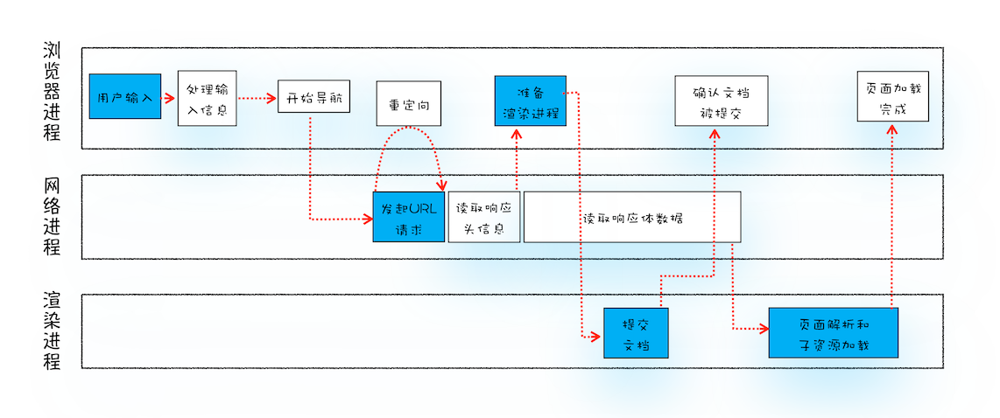
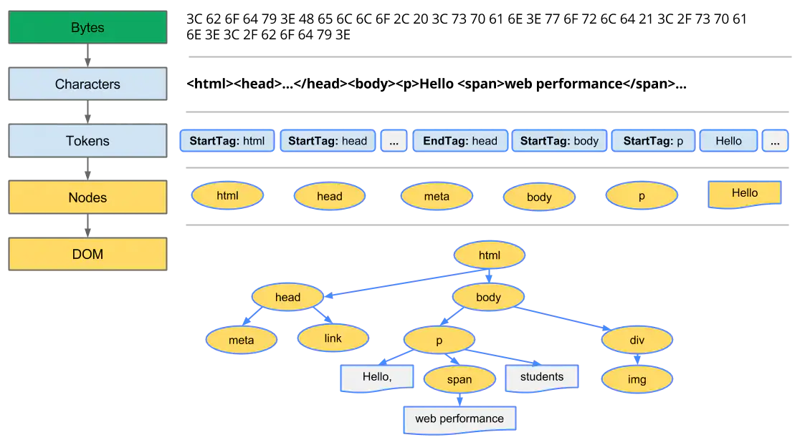
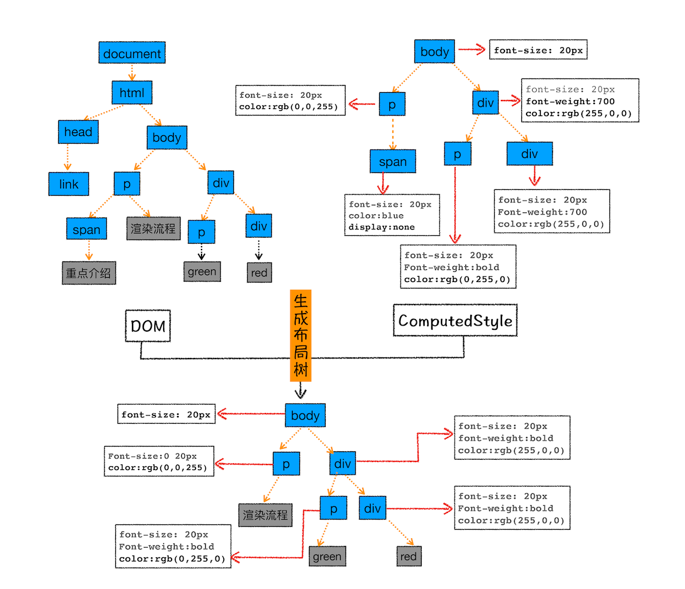

# 浏览器的多进程架构

要了解工作原理，首先就要从浏览器的架构设计入手，现代浏览器是一个**多进程架构**，主要包括以下几个进程：

- 浏览器进程（只有一个）：主要负责界面显示、用户交互、子进程管理，同时提供存储等功能。
- 渲染进程（也叫浏览器内核，一个标签页一个）：核心任务是将 HTML、CSS 和 JavaScript 转换为用户可以与之交互的网页，排版引擎 Blink 和 JavaScript 引擎 V8 都是运行在该进程中，默认情况下，Chrome 会为每个 Tab 标签创建一个渲染进程。出于安全考虑，渲染进程都是运行在沙箱模式下。
- 网络进程：主要负责页面的网络资源加载，之前是作为一个模块运行在浏览器进程里面的，直至最近才独立出来，成为一个单独的进程。
- GPU 进程（最多一个）：其实，Chrome 刚开始发布的时候是没有 GPU 进程的。而 GPU 的使用初衷是为了实现 3D CSS 的效果，只是随后网页、Chrome 的 UI 界面都选择采用 GPU 来绘制，这使得 GPU 成为浏览器普遍的需求。最后，Chrome 在其多进程架构上也引入了 GPU 进程。
- 插件进程：主要是负责插件的运行，因插件易崩溃，所以需要通过插件进程来隔离，以保证插件进程崩溃不会对浏览器和页面造成影响。

浏览器内部存在优化策略，有时候会将多个进程进行合并。

## 渲染进程（浏览器内核）

对于一个前端来说，最需要关心的是渲染进程，这一步涉及 JavaScript 脚本的解析、事件机制和渲染机制等。

渲染进程是多线程的，主要包括：

- GUI 渲染线程
  - 负责页面的渲染，DOM 树构建、样式计算、布局和绘制等，当页面需要重绘和重排的时候，该线程就会重新执行。
- JavaScript 引擎线程
  - 也称为 JavaScript 处理器，负责处理 JavaScript 脚本，如 V8 引擎。
  - 一个标签页中同时只能存在一个线程处理 JavaScript 脚本（JS 单线程）。
- 事件触发线程
  - 控制事件循环
- 定时触发器线程
  - setTimeout 和 setInterval 所在的线程，由于 JavaScript 引擎是单线程的，所以需要另起一个线程来完成计时的功能。
- 异步 HTTP 请求线程
  - 在 XMLHttpRequest 在连接后是通过浏览器新开一个线程请求， 将检测到状态变更时，如果设置有回调函数，异步线程就产生状态变更事件放到 JavaScript 引擎的处理队列中等待处理。

需要注意，GUI 进程和 JavaScript 引擎进程是互斥的，当一个执行的时候，另一个就会被挂起等待执行中的线程完成，如果 JavaScript 引擎线程运行时间过长则会引起页面渲染阻塞。

# 从输入 URL 到页面展示中间发生了什么？

从一个老问题出发，去了解浏览器的大致工作原理，下图是大致流程：

## 浏览器进程

这里主要进行用户输入处理，当用户在输入框输入一个查询关键字时，浏览器会判断输入的关键字是搜索内容，还是请求的 URL。

- 如果是搜索内容，地址栏会使用浏览器默认的搜索引擎，来合成新的带搜索关键字的 URL。
- 如果判断输入内容符合 URL 规则，比如输入的是 github.com，那么地址栏会根据规则，把这段内容加上协议，合成为完整的 URL，如 https://github.com。

用户键入回车之后，浏览器会触发一次 `beforeunload` 事件，开发者可以在页面跳转（窗口关闭）前进行一些处理。

## 网络进程

这一步最多需要完成构建请求、缓存查找、发出请求和响应处理四个步骤。

### 构建请求

首先，浏览器构建请求行信息，构建好后，浏览器准备发起网络请求。

### 缓存查找

在发起网络请求之前，浏览器会进行缓存的查找。

通过 `Cache-Control` 判断强缓存是否可用：

- 强缓存可用则无需请求服务器，直接使用缓存资源；
- 否则使用协商缓存，向服务器发送网络请求，服务器通过 `if-Modified-Since` 或者 `If-None-Match` 判断缓存是否可用：
  - 缓存可用，返回 304 告知浏览器可直接使用缓存。
  - 缓存不可用，返回新的资源和 200 状态码，浏览器响应后更新缓存。

网络进程拿到可用缓存之后将资源直接返回给浏览器进程。

### 发出请求

没有缓存的情况下，浏览器在构建完请求之后就会向服务器发起请求。

1. 进行 DNS 解析，得到 IP 地址（涉及缓存等）
2. IP 地址查找
3. 等待 TCP 连接队列空闲（chrome 对于同一域名的 TCP 连接数有限制，最多只有 6 个，满了就等）
4. 建立 TLS 连接（如果是 HTTPS 的话）
5. 建立 TCP 连接
6. 向服务器发起请求
7. 服务器处理请求

### 响应处理

收到服务器的响应之后，浏览器还需要根据响应进行不同的处理。

1. 浏览器处理响应
   - 重定向处理：如果服务器响应行的状态码包含了 301、302 一类的跳转信息，浏览器会跳转到新的地址继续导航；如果响应行是 200，那么表示浏览器可以继续处理该请求；
   - 响应数据类型处理：通过响应头的 Content-Type 判断响应资源的类型，当 Content-Type 的值是 application/octet-stream 时，浏览器会按照下载类型处理该请求，该请求会被提交给浏览器的下载管理器，同时该 URL 请求的导航流程就此结束。
2. 准备渲染进程
   判断是否存在同一站点（根域名和协议名相同），当存在同一站点时，复用同一站点的渲染进程，否则开启一个新的渲染进程。
3. 提交文档
   - 首先当浏览器进程接收到网络进程的响应头数据之后，便向渲染进程发起“提交文档”的消息；
   - 渲染进程接收到“提交文档”的消息后，会和网络进程建立传输数据的“管道”；
   - 等文档数据传输完成之后，渲染进程会返回“确认提交”的消息给浏览器进程；
   - 浏览器进程在收到“确认提交”的消息后，会更新浏览器界面状态，包括了安全状态、地址栏的 URL、前进后退的历史状态，并更新 Web 页面。

## 渲染进程

### 构建 DOM 树

 1. 转换：浏览器从磁盘或网络读取 HTML 的原始字节，并根据文件的指定编码（例如 UTF-8）将它们转换成各个字符。 2. 令牌化：浏览器将字符串转换成 W3C HTML5 标准规定的各种令牌，例如，“”、“”，以及其他尖括号内的字符串。每个令牌都具有特殊含义和一组规则。 3. 词法分析：发出的令牌转换成定义其属性和规则的“对象”。 4. DOM 构建：最后，由于 HTML 标记定义不同标记之间的关系（一些标记包含在其他标记内），创建的对象链接在一个树数据结构内，此结构也会捕获原始标记中定义的父项-子项关系：HTML 对象是 body 对象的父项，body 是 paragraph 对象的父项，依此类推。

### 样式计算（Recalculate Style）

1.  把 CSS 转换为 styleSheets：可以通过 `document.styleSheets` 查看，是一个对象；
2.  标准化样式表中的值：如：`font-size: 2em` 会被计算成 `font-size: 32px`；
3.  计算出 DOM 树中每个节点的具体样式：基于 CSS 的继承规则和层叠规则计算出每一个 DOM 节点具体的样式，计算出来的结果会被保存在 `ComputedStyle` 中，可以通过 `window.getComputedStyle(element)` 查看 DOM 节点的计算结果。

### 布局

1.  创建布局树：遍历所有可见的 DOM 节点，并将这些节点添加到布局树中；
    
2.  布局计算

### 分层

1. 生成图层树（Layer Tree）
   浏览器的页面实际上被分成了很多图层，这些图层叠加后合成了最终的页面，图层与布局树之间关系，如下图所示：
   
   通常情况下，并不是布局树的每个节点都包含一个图层，如果一个节点没有对应的层，那么这个节点就从属于父节点的图层。
   对于至少满足以下其中一种情况的节点，渲染引擎才会为其创建新的图层：

   - 拥有层叠上下文属性的元素会被提升为单独的一层，层叠上下文基本上是由一些特定的 CSS 属性创建的，一般有以下情况:

     - HTML 根元素本身就具有层叠上下文。
     - 普通元素设置 position 不为 static 并且设置了 z-index 属性，会产生层叠上下文。
     - 元素的 opacity 值不是 1
     - 元素的 transform 值不是 none
     - 元素的 filter 值不是 none
     - 元素的 isolation 值是 isolate
     - will-change 指定的属性值为上面任意一个

   - 需要剪裁（clip）的地方也会被创建为图层
     - 比如一个标签很小，50\*50 像素，你在里面放了非常多的文字，那么超出的文字部分就需要被剪裁。当然如果出现了滚动条，那么滚动条也会被单独提升为一个图层。

### 图层绘制

渲染引擎实现的图层绘制会把一个图层的绘制拆分成很多小的绘制指令，然后再把这些指令按照顺序组成一个待绘制列表，最后由主线程提交到合成线程。

### 栅格化（raster）操作

### 合成和显示

# 参考链接

- [从浏览器多进程到 JS 单线程，JS 运行机制最全面的一次梳理](https://segmentfault.com/a/1190000012925872)
- [浏览器工作原理与实践](https://time.geekbang.org/column/intro/216)
