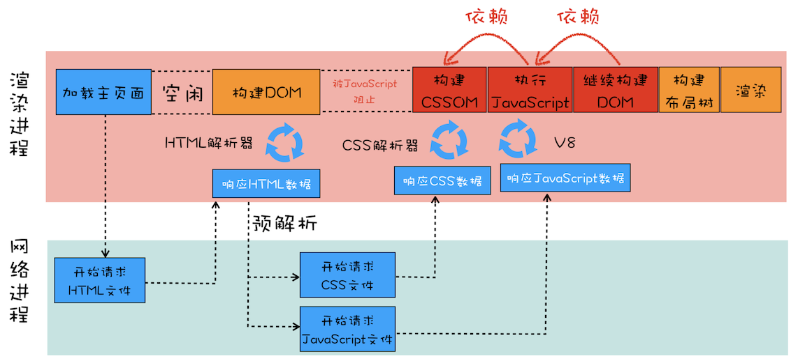

# 渲染优化

页面的渲染流水线主要包括构建 DOM 树、样式计算（Recalculate Style）、布局、分层、图层绘制、栅格化（raster）操作、合成和显示几个步骤。

在渲染流水线中，后续的操作都直接或者间接地依赖于 DOM 结构，在某些情况下，JavaScript 脚本是会影响到 DOM 树的生成的，从而影响到页面的渲染。

## 缩短首次加载时的白屏时间

在浏览器拿到服务器的资源并提交给渲染进程之后，渲染进程会创建一个空白页面，，并等待 CSS 文件和 JavaScript 文件的加载完成，生成 CSSOM 和 DOM，然后合成布局树，最后还要经过一系列的步骤准备首次渲染，我们通常把这段时间称为**解析白屏**。

先看一段代码，分析一下它的渲染流程。

```html
<html>
  <head>
    <style src="main.css"></style>
  </head>
  <body>
    <div>hello</div>
    <script type="text/javascript" src="foo.js"></script>
    <div>world</div>
  </body>
</html>
```

上述代码，当 HTML 解析器解析到 `<script></script>` 的时候会先暂停解析，等待外部的 CSS 和 JavaScript 文件下载完成，并解析生成 CSSOM 对象之后，再转由 JavaScript 引擎去接盘，并执行这一段脚本，执行完成之后才会继续解析后面的 DOM 节点，通常下载又是非常耗时的，会受到网络环境、文件大小等因素的影响，这时候就有可能造成页面的阻塞。

> 对此，Chrome 浏览器做了很多优化，其中一个主要的优化是预解析操作。当渲染引擎收到字节流之后，会开启一个预解析线程，用来分析 HTML 文件中包含的 JavaScript、CSS 等相关文件，解析到相关文件之后，预解析线程会提前下载这些文件。

总结一下，含有 JavaScript 文件和 CSS 文件页面的渲染流水线大致如下：



这个阶段的主要任务包括了解析 HTML、下载 CSS、下载 JavaScript、生成 CSSOM、执行 JavaScript、生成布局树、绘制页面一系列操作，通常情况下的瓶颈主要体现在下载 CSS 文件、下载 JavaScript 文件和执行 JavaScript。

### 优化方案

- 通过内联 JavaScript、内联 CSS 来移除这两种类型的文件下载，这样获取到 HTML 文件之后就可以直接开始渲染流程了。
- 减少文件大小，比如通过 webpack 等工具移除一些不必要的注释，并压缩文件。
- 还可以将一些不需要在解析 HTML 阶段使用的 JavaScript 标记上 sync 或者 defer。
- 对于大的 CSS 文件，可以通过媒体查询属性，将其拆分为多个不同用途的 CSS 文件，这样只有在特定的场景下才会加载特定的 CSS 文件。
- CDN 加速。
- 减少 JavaScript 脚本的执行时间，可以对会占用大块执行时间的函数进行拆分，也可以合理使用 Web Workers，把一些和 DOM 操作无关且耗时的任务放到 Web Workers 中去执行。

对于 `<script></script>` 标签的异步引用，需要注意一点:

> async 和 defer 虽然都是异步的，不过还有一些差异，使用 async 标志的脚本文件一旦加载完成，会立即执行；而使用了 defer 标记的脚本文件，需要在 DOMContentLoaded 事件之前执行。

### 几个问题

1. CSS 是否会造成页面的阻塞？

   - 虽然 CSS 不阻塞 DOM 的生成和 JavaScript 的加载，但是会阻塞 JavaScript 的执行，由于 JavaScript 会阻塞 DOM 的生成，CSS 的阻塞也会造成页面渲染的阻塞，那么可以说，CSS 也有可能会阻塞页面的渲染。

2. 为什么 script 标签要放在最后？

   - 虽然 script 标签无论放到哪里，都会阻塞页面的渲染，但是放到最后可以避免前面的 DOM 节点被阻塞。

## 避免页面交互阶段的性能损耗

在页面第一次渲染完成之后，一些方式可能使渲染流程回到某个地方重新开始渲染，造成性能的损耗。

### 重排

当改变了元素的布局信息之后，就会引起重排，重新渲染元素的布局。


一些会引起重排的常见操作

- 添加或删除可见的 DOM 元素
- 元素的位置发生变化
- 元素的尺寸发生变化
- 内容发生变化，比如文本变化或图片被另一个不同尺寸的图片所替代。
- 浏览器的窗口尺寸变化（因为重排是根据视口的大小来计算元素的位置和大小的）
- 一些获取布局信息的属性和方法
  - offsetTop、offsetLeft、offsetWidth、offsetHeight
  - scrollTop、scrollLeft、scrollWidth、scrollHeight
  - clientTop、clientLeft、clientWidth、clientHeight
  - getComputedStyle()
  - getBoundingClientRect()

详细内容可以参考：[What forces layout / reflow](https://gist.github.com/paulirish/5d52fb081b3570c81e3a)

### 重绘


如果只是修改了元素的绘制属性，那么布局阶段将不会被执行，因为并没有引起几何位置的变换，所以就会直接进入绘制阶段，然后执行之后的一系列子阶段，这个过程就叫重绘。

相较于重排操作，重绘省去了布局和分层阶段，所以执行效率会比重排操作要高一些。

### 合成


如果更改了一个既不要布局也不要绘制的属性，那么渲染引擎会跳过布局和绘制，直接执行后续的合成操作，这个过程就叫合成。

比如使用了 CSS 的 transform 来实现动画效果，这样可以避开重排和重绘阶段，直接在非主线程上执行合成动画操作。这样的效率是最高的，因为是在非主线程上合成，并没有占用主线程的资源，另外也避开了布局和绘制两个子阶段，所以相对于重绘和重排，合成能大大提升绘制效率。

在实际中，提升合成层的最好方式是使用 CSS 的 will-change 属性，这样子渲染引擎会为其单独实现一个图层，当这些变换发生时，仅仅只是利用合成线程去处理这些变换，而不牵扯到主线程，大大提高渲染效率。

### 避免强制同步布局

强制同步布局是指 JavaScript 强制将计算样式和布局操作提前到当前的任务中。

通过 DOM 接口执行添加元素或者删除元素等操作后，是需要重新计算样式和布局的，不过正常情况下这些操作都是在另外的任务中异步完成的，这样做是为了避免当前的任务占用太长的主线程时间。

```js
function logBoxHeight() {
  box.classList.add("super-big");
  // Gets the height of the box in pixels
  // and logs it out.
  console.log(box.offsetHeight);
}
```

如上述代码，我们修改了元素的样式，此时浏览器会异步完成样式计算和布局，但是我们在接下来就使用了元素的布局信息，浏览器为了得到正确的布局信息，则会触发
强制同步布局，同步地完成样式计算和布局，造成性能的损耗。

为了避免强制同步布局，我们可以调整策略，在修改 DOM 之前查询相关值。代码如下所示：

```js
function logBoxHeight() {
  // Gets the height of the box in pixels
  // and logs it out.
  console.log(box.offsetHeight);
  box.classList.add("super-big");
}
```

大部分情况下，并不需要应用样式然后查询值；使用上一帧的值就足够了，应该尽量避免这种设计。

### GPU 加速（CSS 硬件加速）

启用 GPU 加速可以优化重排、重绘时的性能，常见的触发 GPU 加速的 CSS 属性：

- transform
- opacity
- filters
- Will-change

但是开启 GPU 加速也是会额外占用内存的。

## 参考链接

- [你真的了解回流和重绘吗](https://juejin.im/post/6844903779700047885)
- [浏览器工作原理与实践](https://time.geekbang.org/column/intro/216)
- [What forces layout / reflow](https://gist.github.com/paulirish/5d52fb081b3570c81e3a)
- [避免大型、复杂的布局和布局抖动](https://developers.google.com/web/fundamentals/performance/rendering/avoid-large-complex-layouts-and-layout-thrashing?hl=zh-cn)
