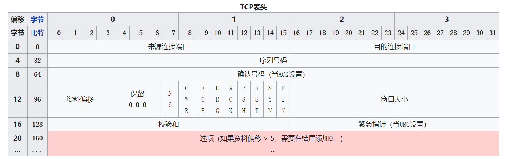
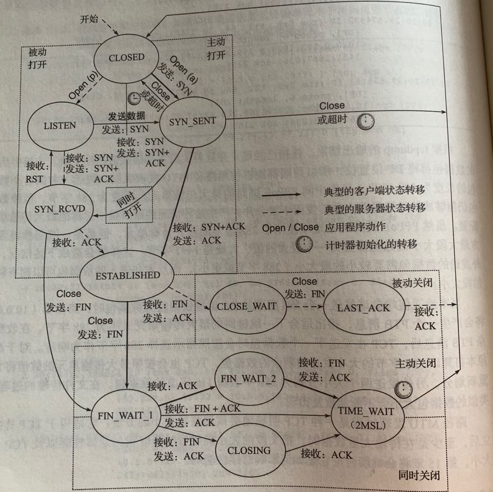

# TCP

传输控制协议（英语：Transmission Control Protocol，缩写：TCP）是一种面向连接的、可靠的、基于字节流的传输层通信协议。

## 特点

- 数据分片：在发送端对用户数据进行分片，并在接收端进行重组，由 TCP 确认分片的大小并控制分片和重组。
- 到达确认：接收端在接收到数据的时候,需要根据分片数据序号向发送端发送一个确认。
- 超时重发：发送方在发送分片时启动一个定时器，在定时器超时之前如果没有收到确认回复，则重发分片。
- 流量控制：TCP 连接每一方的接收缓存空间大小都固定，接收端只允许发送端发送接收端缓冲区域所能接纳的数据，TCP 在滑动窗口的基础上提供流量控制，防止较快的主机使较慢的主机缓冲溢出。
- 拥塞控制：发送方和接收方之间可能会存在性能不足的路由器，而发送方的发送速率可能会超过某个路由器的处理能力导致丢包，这时候就进行一种特殊的流量控制，即拥塞控制。
- 失序处理：作为 IP 数据报来传输的 TCP 分片到达时可能会出现失序，TCP 将对接收到的数据进行重新排序，确保交给应用层的数据是正确的顺序。
- 重复处理：TCP 分片可能会发生重复，TCP 的接收端必须丢弃重复的数据。
- 数据校验：TCP 将保持它首部和数据的校验和，目的是检测数据在传输过程中发生的变化，如果收到的分片校验和有误，TCP 将丢弃这个分片，并且不会发送确认信息，使发生方超时重发。

## TCP 的数据包结构

如下图所示：

- 来源端口（16 位）
- 目的端口（16 位）
- 序列号（Sequence Number，32 位）
  - 该字段标识了 TCP 发送端到 TCP 接收端的数据流的一个字节，该字节代表着包含该序列号的报文段的数据中的第一个字节；序列号是一个 32 位的无符号数，到 232-1 后循环回到 0。
- 确认号（ACK 号，32 位）
  - 该字段包含的值是该确认号的发送方期待接收的下一个序列号，即为最后成功收到的数据字节的序列号加 1。
- 头部字段
  - NS
  - CWR
  - ECE
  - URG：为 1 表示高优先级数据包，紧急指针字段有效。
  - ACK：为 1 表示确认号字段有效。
  - PSH
  - RST
  - SYN：为 1 表示这是连接请求或是连接接受请求，用于创建连接和使顺序号同步。
  - FIN：为 1 表示发送方没有数据要传输了，要求释放连接。
- 窗口（16 位）：表示从确认号开始，本报文的发送方可以接收的字节数，即接收窗口大小。用于流量控制。
- 校验和（16 位）：对整个的 TCP 报文段，包括 TCP 头部和 TCP 数据，以 16 位字进行计算所得。这是一个强制性的字段。
- 紧急指针：本报文段中的紧急数据的最后一个字节的序号。

## TCP 的连接管理

TCP 是一种面向连接的单播协议，在发送数据前，通讯双方必须在彼此之间建立一条连接，一个 TCP 连接通常分为三个阶段：连接建立、数据传输和连接关闭。

**一个 TCP 连接由一对套接字（socket）唯一标识：（客户端 IP 地址、客户端端口号、服务器 IP 地址、服务器端口号）。**

### 连接建立（三次握手）

TCP 通过三次握手来建立连接。

1. 客户端向服务器发送一个 SYN 报文段。
2. 服务器接收到客户端发送的数据后，向客户端发送自己的 SYN 报文段和 ACK 确认号，ACK 的值为从客户端处收到的报文段的序列号数值加 1。
3. 客户端为了确认服务器发送的 SYN 报文段，将会向服务器 ACK 确认号，ACK 的值为从服务器接收到的报文段的序列号数值加 1 。

三次握手的目的不仅仅在于让通信双方了解一个连接正在建立，还在于利用数据包的选型来承载特殊的信息，交换初始序列号（Initial Sequence Number, ISN）。

> 在一个连接中，TCP 报文段在经过网络路由后可能会存在延迟抵达与排序混乱的情况，所以需要谨慎地选择初始序列号。在发送用于建立连接的 SYN 之前，通信双方会选择一个初始序列号，初始序列号会随时间而改变，因此每一个连接都有不同的初始序列号,初始序列号可被视为一个 32 位的计数器，该计数器的值每 4 微秒加 1。

### 连接关闭（四次挥手）

连接的任何一方都可以发起一个关闭操作，该过程还支持双方同时关闭连接的操作。

TCP 协议规定通过发送一个 FIN 段来发起关闭操作。

1. 客户端发送一个 FIN 报文段，告知对方要关闭连接，同时还会发送一个 ACK 确认号确认对方最后一次发送的数据，发送完报文段后客户端进入 `FIN_WAIT_1` 状态。
2. 服务器接收到客户端要释放连接的请求后，会发送一个 ACK 确认信息已经接收，随后服务器进入 `CLOSE_WAIT` 状态，客户端收到 ACK 后进入 `FIN_WAIT_2` 状态。
3. 随后，服务器向客户端发送一个 FIN 报文段，申请断开服务器端到客户端的连接。发送后进入 `LAST_ACK` 状态。
4. 客户端接收到 FIN 请求后，向服务器端发送一个 ACK，并进入 `TIME_WAIT` 阶段。该阶段会持续 2MSL，如果该时间内服务端没有重发请求的话，客户端进入 `CLOSED` 的状态。如果收到服务器的重发请求就重新发送 ACK。服务器端收到客户端的确认报文段后就进入 `CLOSED` 状态。

> 在连接的建立和关闭过程中，如果出现 ACK 确认信息的丢失，会触发接收方的重传机制。

TCP 还存在半关闭、同时打开和同时关闭的情况。

### 状态的转换

TCP 在一个连接的建立到关闭经历了多个状态，具体如下图所示：

| 状态名称     | 端  | 解释                                                                                                                                                                                                     |
| ------------ | --- | -------------------------------------------------------------------------------------------------------------------------------------------------------------------------------------------------------- |
| LISTEN       | S   | 服务器等待从任意远程 TCP 端口的连接请求。侦听状态。                                                                                                                                                      |
| SYN-SENT     | C   | 客户在发送连接请求后等待匹配的连接请求。                                                                                                                                                                 |
| SYN-RECEIVED | S   | 服务器已经收到并发送同步（SYNC）信号之后等待确认（ACK）请求。                                                                                                                                            |
| ESTABLISHED  | S&C | 服务器与客户的连接已经打开，收到的数据可以发送给用户。数据传输步骤的正常情况。此时连接两端是平等的。这称作全连接。                                                                                       |
| FIN-WAIT-1   | S&C | （服务器或客户）主动关闭端调用 close（）函数发出 FIN 请求包，表示本方的数据发送全部结束，等待 TCP 连接另一端的 ACK 确认包或 FIN&ACK 请求包。                                                             |
| FIN-WAIT-2   | S&C | 主动关闭端在 FIN-WAIT-1 状态下收到 ACK 确认包，进入等待远程 TCP 的连接终止请求的半关闭状态。这时可以接收数据，但不再发送数据。                                                                           |
| CLOSE-WAIT   | S&C | 被动关闭端接到 FIN 后，就发出 ACK 以回应 FIN 请求，并进入等待本地用户的连接终止请求的半关闭状态。这时可以发送数据，但不再接收数据。                                                                      |
| CLOSING      | S&C | 在发出 FIN 后，又收到对方发来的 FIN 后，进入等待对方对己方的连接终止（FIN）的确认（ACK）的状态。少见。                                                                                                   |
| LAST-ACK     | S&C | 被动关闭端全部数据发送完成之后，向主动关闭端发送 FIN，进入等待确认包的状态。                                                                                                                             |
| TIME-WAIT    | S/C | 主动关闭端接收到 FIN 后，就发送 ACK 包，等待足够时间以确保被动关闭端收到了终止请求的确认包。【按照 RFC 793，一个连接可以在 TIME-WAIT 保证最大四分钟，即最大分段寿命（maximum segment lifetime）的 2 倍】 |
| CLOSED       | S&C | 完全没有连接。                                                                                                                                                                                           |

TIME_WAIT 状态也称为 2MSL 等待状态，在该状态中，TCP 将会等待两倍于最大段生存期（Maximum Segmment Lifetime, MSL） 的时间。等待 2MSL 的原因有两点：

- **确保最后一个 ACK 能够被成功接收**，如果最后一个 ACK 丢失，被动关闭方会重传 FIN，这时候需要主动关闭方再次进行确认；如果在 1 个 MSL 时间内自己发送的 ACK 对方没有收到那就注定收不到了，而且对方肯定还会发送 FIN，那么一个 FIN 发送过来的最长时间也是 1 个 MSL，所以这里要等待 2MSL。
- **避免延迟的 IP 报文**，在频繁短连接的场景下，有可能出现上一个 socket 和下一个 socket 相同的情况，等待 2MSL，让该次连接持续时间内所产生的所有报文都从网络中消失，确保下一个新的连接不会出现旧的连接请求报文。

## 重传机制

当数据段或确认信息丢失时，TCP 启动重传操作，重传尚未确认的数据。TCP 拥有两套独立机制来完成重传：

- 基于时间的重传，称为超时重传 RTO(Retransmission Timeout)；
- 基于确认信息的构成的重传，称为快速重传。

### 超时重传 RTO

### 快速重传
