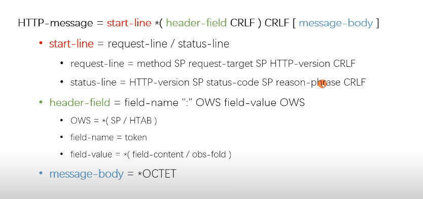

# 应用层协议 HTTP

HTTP 是超文本传输协议，它定义了客户端和服务器之间交换报文的格式和方式，默认使用 80 端口。

## HTTP 报文

HTTP 报文是 HTTP 协议的核心内容，HTTP 协议在规范文档里详细定义了报文的格式，规定了组成部分，解析规则和处理策略，所以可以在 TCP/IP 层之上实现更灵活丰富的功能，例如连接控制，缓存管理、数据编码、内容协商等等。

HTTP 报文主要由起始行，报文首部和报文体（可选）三大部分构成；HTTP 报文又根据发送方的不同分为请求报文和响应报文。

如图：



所有的 HTTP 报文都以一个起始行作为开始，请求报文的起始行说明了要做什么，响应报文的起始行说明发生了什么。

### 请求报文的起始行

根据 RFC 文档的定义，请求行（request-line）为：

```http
method SP request-target SP HTTP-version CRLF
```

**常规的请求行由请求方法，请求目标和 http 协议版本号组成。**

比如 `GET /web/api/rest/articles/list?page=5&current=0 HTTP/1.1`

对照上面的定义就是：

```http
method = GET
request-target = /web/api/rest/articles/list?page=5&current=0
HTTP-version = HTTP/1.1
```

### 响应报文的起始行

根据 RFC 文档的定义，响应行（status-line）为：

```http
HTTP-version SP status-code SP reason-phrase CRLF
```

响应行由 http 版本号，状态码和状态码的解释三部分组成。

## 请求方法

HTTP 定义了一组请求方法, 以表明要对给定资源执行的操作,请求方法主要有以下几种：

| 请求方法 | 作用                                                  | 幂等性       |
| -------- | ----------------------------------------------------- | ------------ |
| GET      | 从服务器获取一份文档                                  | 幂等         |
| HEAD     | 类似 GET 方法，但服务器不返回 body                    | 幂等         |
| POST     | 向服务器发送需要处理的数据，如 FORM 表单提交          | 非幂等       |
| PUT      | 将请求的 body 部分存储在服务器上                      | 带条件时幂等 |
| TRACE    | 回显服务器收到的请求，用于问题定位                    | 非幂等       |
| OPTIONS  | 显示服务器对访问资源的支持方法，CORS 解决跨域时会用到 | 幂等         |
| DELETE   | 从服务器上删除一份文档                                | 幂等         |

### GET 和 POST 的区别

- 从缓存角度看，GET 请求后浏览器会主动缓存，POST 默认情况下不能。
- 从参数角度来看，GET 请求一般放在 URL 中，因此不安全，POST 请求放在请求体中，相对而言较为安全，但是在抓包的情况下都是一样的。
- 从编码角度看，GET 请求只能经行 URL 编码，只能接受 ASCII 码，而 POST 支持更多的编码类型且不对数据类型限值。
- 从幂等性看，GET 请求幂等，POST 请求不幂等，幂等指发送 M 和 N 次请求（两者不相同且都大于 1），服务器上资源的状态一致。
- GET 请求会一次性发送请求报文，POST 请求通常分为两个 TCP 数据包，首先发 header 部分，如果服务器响应 100(continue)， 然后发 body 部分。
- 从应用场景角度来看，Get 多用于无副作用，幂等的场景，例如搜索关键字。Post 多用于副作用，不幂等的场景，例如注册。

## 状态码

状态码主要由 1xx 系列，2xx 系列，3xx 系列，4xx 系列和 5xx 系列组成。

| 状态码 | 原因短语                                   | 含义                                                                                                                                                                                                  |
| ------ | ------------------------------------------ | ----------------------------------------------------------------------------------------------------------------------------------------------------------------------------------------------------- |
| 200    | OK                                         | 正常返回信息                                                                                                                                                                                          |
| 201    | Created                                    | 请求成功且服务器创建了新资源                                                                                                                                                                          |
| 202    | Accepted                                   | 服务器已接受请求并开始进行处理，但请求尚未处理完成                                                                                                                                                    |
| 203    | Non-Authoritative                          | 当代理服务器修改了 origin server 的 原始响应包体时（例如更换了 HTML 中的元素值），代理服务器可以通过修改 200 为 203 的方式告知客户端这一事实，方便客户端为这一行为作出相应的处理。 203 响应可以被缓存 |
| 204    | No Content                                 | 成功执行了请求且不携带响应包体，并暗示客户端无需 更新当前的页面视图                                                                                                                                   |
| 205    | Reset Content                              | 成功执行了请求且不携带响应包体，同时指明客户端 需要更新当前页面视图                                                                                                                                   |
| 206    | Partial Content                            | 使用 range 协议时返回部分响应内容时的响应码                                                                                                                                                           |
| 300    | Multiple Choices                           | 资源有多种表述，通过 300 返回给客户端后由其 自行选择访问哪一种表述。由于缺乏明确的细节，300 很少使用                                                                                                  |
| 301    | Moved Permanently                          | 资源永久性的重定向到另一个 URI 中                                                                                                                                                                     |
| 302    | Found                                      | 资源临时的重定向到另一个 URI 中                                                                                                                                                                       |
| 303    | See Other                                  | 重定向到其他资源，常用于 POST/PUT 等方法的响应中                                                                                                                                                      |
| 304    | Not Modified                               | 当客户端拥有可能过期的缓存时，会携带缓存的标识 etag、时间等信息询问服务器缓存是否仍可复用，而 304 是告诉客户端可以 复用缓存                                                                           |
| 400    | Bad Request                                | 服务器认为客户端出现了错误，但不能明确判断为以下哪种错误 时使用此错误码。例如 HTTP 请求格式错误                                                                                                       |
| 401    | Unauthorized                               | 用户认证信息缺失或者不正确，导致服务器无法处理请求                                                                                                                                                    |
| 403    | Forbidden                                  | 服务器理解请求的含义，但没有权限执行此请求                                                                                                                                                            |
| 404    | Not Found                                  | 服务器没有找到对应的资源                                                                                                                                                                              |
| 405    | Method Not Allowed                         | 服务器不支持请求行中的 method 方法                                                                                                                                                                    |
| 406    | Not Acceptable                             | 对客户端指定的资源表述不存在（例如对语言或者编码有要 求），服务器返回表述列表供客户端选择                                                                                                             |
| 407    | Proxy Authentication Required              | 对需要经由代理的请求，认证信息未通过代理 服务器的验证                                                                                                                                                 |
| 408    | Request Timeout                            | 服务器接收请求超时                                                                                                                                                                                    |
| 409    | Conflict                                   | 资源冲突，例如上传文件时目标位置已经存在版本更新的资源                                                                                                                                                |
| 410    | Gone                                       | 服务器没有找到对应的资源，且明确的知道该位置永久性找不到该资源                                                                                                                                        |
| 411    | Length Required                            | 如果请求含有包体且未携带 Content-Length 头部，且不属于 chunk 类请求时，返回 411                                                                                                                       |
| 412    | Precondition Failed                        | 复用缓存时传递的 If-Unmodified-Since 或 IfNone-Match 头部不被满足                                                                                                                                     |
| 413    | Payload Too Large/Request Entity Too Large | 请求的包体超出服务器能处理的最大长度                                                                                                                                                                  |
| 414    | URI Too Long                               | 请求的 URI 超出服务器能接受的最大长度                                                                                                                                                                 |
| 415    | Unsupported Media Type                     | 上传的文件类型不被服务器支持                                                                                                                                                                          |
| 416    | Range Not Satisfiable                      | 无法提供 Range 请求中指定的那段包体                                                                                                                                                                   |
| 417    | Expectation Failed                         | 对于 Expect 请求头部期待的情况无法满足时的 响应码                                                                                                                                                     |
| 500    | Internal Server Error                      | 服务器内部错误，且不属于以下错误类型                                                                                                                                                                  |
| 501    | Not Implemented                            | 服务器不支持实现请求所需要的功能                                                                                                                                                                      |
| 502    | Bad Gateway                                | 代理服务器无法获取到合法响应                                                                                                                                                                          |
| 503    | Service Unavailable                        | 服务器资源尚未准备好处理当前请求                                                                                                                                                                      |
| 504    | Gateway Timeout                            | 代理服务器无法及时的从上游获得响应                                                                                                                                                                    |
| 505    | HTTP Version Not Supported                 | 请求使用的 HTTP 协议版本不支持                                                                                                                                                                        |

## 报文首部

报文首部可以大致可以分为通用首部、请求首部、响应首部、实体首部和扩展首部。

### 通用首部

通用首部是指客户端和服务器都可以使用的首部。

| 首部名称          | 描述                                                                             |
| ----------------- | -------------------------------------------------------------------------------- |
| Connection        | 允许客户端和服务器指定与请求/响应连接有关的选项                                  |
| Date              | 提供日期和时间标志，说明报文是什么时间创建的                                     |
| MIME-Version      | 给出了发送端使用的 MIME 版本                                                     |
| Trailer           | 如果报文使用了分块传输编码方式，就可以使用这个首部列出位于报文拖挂部分的首部集合 |
| Transfer-Encoding | 告知接收端为了保证报文的可靠传输，对报文采用了什么编码方式                       |
| Update            | 给出了发送端可能想要“升级”使用的新版本或者协议                                   |
| Via               | 显示了报文经过的中间节点                                                         |
| Cache-Control     | 缓存指示                                                                         |
| Pragma            | 也是缓存指示                                                                     |

### 请求首部

请求首部是请求报文特有的首部，用于说明是谁在发送请求，请求来自哪里，以及表面客户端的想法和能力。

| 首部名称            | 描述                                                         |
| ------------------- | ------------------------------------------------------------ |
| Client-IP           | 表明客户端的 IP 地址                                         |
| From                | 表明客户端用户的 E-mail 地址                                 |
| Host                | 表明请求的服务器的主机名和端口号                             |
| Referer             | 表明当前请求 URI 的文档的 URL                                |
| User-Agent          | 表明发起请求的应用程序名称                                   |
| Accept              | 告诉服务器能发送哪些媒体类型                                 |
| Accept-Charset      | 告诉服务器能够发送哪些字符集                                 |
| Accept-Encoding     | 告诉服务器能够发送哪些编码方式                               |
| Accept-Language     | 告诉服务器能够发送哪些语言                                   |
| Expect              | 允许客户端列出某请求所要求的服务器行为                       |
| If-Match            | 如果实体标记与文档当前的实体标记相匹配，就获得这份文档       |
| If-Modified-Since   | 除非在某个指定的日期之后资源被修改过，否正就限制这个请求     |
| If-None-Match       | 如果实体标记与文档当前的实体标记不匹配，就获得这份文档       |
| If-Range            | 允许对文档的某个范围进行条件请求                             |
| If-Unmodified-Since | 除非在某个指定日期之后资源就没有被修改过，否则就限制这个请求 |
| Range               | 如果服务器支持范围请求，就请求资源的指定范围                 |
| Authorization       | 提供给服务器验证客户端身份的数据                             |
| Proxy-Authorization | 提供给代理服务器验证客户端身份的数据                         |
| Proxy-Connection    | 允许客户端和代理服务器指定与请求/响应连接有关的选项          |

### 响应首部

响应报文特有的首部，为客户端提供一些额外信息以便于客户端更好地处理响应。

| 首部名称           | 描述                                                                                                      |
| ------------------ | --------------------------------------------------------------------------------------------------------- |
| Age                | 响应持续时间                                                                                              |
| Public             | 服务器为其资源支持的请求方法列表                                                                          |
| Retry-After        | 如果资源不可用的话，在此时间后重试                                                                        |
| Server             | 服务器应用程序的名称和版本                                                                                |
| Accept-Range       | 对此资源，服务器接受的范围类型                                                                            |
| Vary               | 用于列出一个响应字段列表，告诉其他服务器遇到同一个 URL 对应着不同版本文档的情况时，如何筛选出最合适的版本 |
| Proxy-Authenticate | 来自代理的对客户端的质询列表                                                                              |
| WWW-Authenticate   | 来自服务器的对客户端的质询列表                                                                            |

### 实体首部

用于描述传输的实体内容的首部。

| 首部名称         | 描述                                  |
| ---------------- | ------------------------------------- |
| Content-Base     | 解析主体中的相对 URL 时使用的基础 URL |
| Content-Encoding | 对主体执行的任意编码方式              |
| Content-Language | 理解主体最合适的自然语言              |
| Content-Length   | 主体的 size                           |
| Content-Location | 资源实际位置                          |
| Content-MD5      | 主体的 MD5 校验和                     |
| Content-Range    | 在整个资源中该实体的字节范围          |
| Content-Type     | 该主体的对象类型                      |
| ETag             | 实体标记                              |
| Expires          | 实体过期的绝对时间                    |
| Last-Modified    | 该实体最后修改时间                    |

### 扩展首部

扩展首部是指未纳入协议规范，由开发者自行实现的首部，如`set-cookie`。

## HTTP 的包体传输

### 包体定长

当发送 HTTP 消息时已能够确定包体的全部长度，此时使用 `Coontent-Length` 头部明确指明包体长度是多少，且必须与实际传输的包体长度一致。

当实际传输的长度和 `Coontent-Length` 不一致时，接收端很可能会拒绝此次传输，导致传输失败。

### 包体不定长

对于不定长的包体，需要在头部设置 `Transfer-Encoding: chunked` 对接收端表明是分块传输。

特点

- 基于长连接持续推送动态内容。
- 压缩体积较大的包体时，无需完全压缩完（计算出头部）再发送，可以边发送边压缩。
- Content-Length 字段会被忽略。

### 断点续传

对于大文件传输的场景，HTTP 允许服务器基于客户端的请求只发送响应包体的一部分给到客户端，而客户端自动将多个片段的包体组合成完整的体积更大的包体。

当然，并不是所有的服务器都支持这种请求方式，服务器可以添加一个 `Accept-Ranges` 头部表示是否支持 Range 请求，如果服务器不支持范围请求，则返回 200 状态码和完整包体。

例如：

```js
// Accept-Ranges:bytes 支持字节为单位进行传输
// Accept-Ranges:none 不支持
```

客户端需要通过一个 `range` 头部来指定请求的范围。

例如：
```js
// range:bytes=-499 请求前500个字节
// range:bytes=500-599 请求从500开始的100个字节
// range:bytes=600- 请求600字节之后的全部

// range:bytes=500-599 600-699 700-799 多个范围
```

服务器收到请求之后，首先验证范围是否合法，如果越界了那么返回 416 错误码，否则读取相应片段，返回 206 状态码。

同时，服务器需要添加 Content-Range 字段，这个字段的格式根据请求头中 Range 字段的不同而有所差异。

对于单段数据

```
HTTP/1.1 206 Partial Content
Content-Length: 10
Accept-Ranges: bytes
Content-Range: bytes 0-9/100

i am xxxxx
```

在 Content-Range 字段中，0-9表示请求的返回，100表示资源的总大小。

对于多段数据

```
HTTP/1.1 206 Partial Content
Content-Type: multipart/byteranges; boundary=00000010101
Content-Length: 189
Connection: keep-alive
Accept-Ranges: bytes


--00000010101
Content-Type: text/plain
Content-Range: bytes 0-9/96

i am xxxxx
--00000010101
Content-Type: text/plain
Content-Range: bytes 20-29/96

eex jspy e
--00000010101--
```

在 Content-Type 字段中

- `multipart/byteranges` 用于表明这是一个多段数据请求。
- `boundary=00000010101` 表明响应体中的分隔符是 `00000010101`。

在响应体中各段数据之间会由这里指定的分隔符分开，而且在最后的分隔末尾添上 `--` 表示结束。

## HTTP 连接模式

HTTP 有两种连接模式，一种是持续连接，一种非持续连接。

- 非持续连接指的是服务器必须为每一个请求的对象建立和维护一个全新的连接。

- 持续连接模式下，TCP 连接默认不关闭，可以被多个请求复用。采用持续连接的好处是可以避免每次建立 TCP 连接三次握手时所花费的时间。

在 HTTP1.0 以前使用的是非持续连接，但是可以在请求时，加上 `Connection:keep-alive` 来要求服务器不要关闭 TCP 连接。

HTTP1.1 以后默认采用的是持续连接。目前对于同一个域，大多数浏览器支持同时建立 6 个持久连接。

## HTTP 特点

- 请求-应答模式：通常是一方发送消息，另外一方要接受消息，或者是做出响应等。
- 可靠传输：HTTP 使用 TCP 作为传输层协议，保证了数据传输的可靠性。
- 无状态：HTTP 服务器不会保存关于客户的任何信息。

## HTTP/1.1 缺点

HTTP/1.1 主要有两个缺点：明文传输和队头阻塞。

### 明文传输

即协议里的报文(主要指的是头部)不使用二进制数据，而是文本形式。这让 HTTP 的报文信息暴露给了外界，给攻击者带来了便利。

这里我们可以使用 HTTPS（HTTP + TLS/SSL） 来解决这个问题。

### 队头阻塞

HTTP/1.1 默认使用了持久连接，多个请求可以复用同一个 TCP 连接，但是在同一个 TCP 连接里面，数据请求的通信次序是固定的，服务器只有处理完一个请求的响应后，才会进行下一个请求的处理，如果前面请求的响应特别慢的话，就会造成许多请求排队等待的情况，这种情况被称为**队头堵塞**。

队头阻塞会导致持久连接在达到最大数量时，剩余的资源需要等待其他资源请求完成后才能发起请求。

造成队头阻塞的根本原因是并发量太大，所以从这个方向出发，可以采用**域名分片**的方法去解决，在一个域名下分出多个二级域名出来，而它们最终指向的还是同一个服务器，这样子的话就可以并发处理的任务队列更多，也更好的解决了队头阻塞的问题。

## HTTP 协议的版本差异

### HTTP/0.9

1991 年的原型版本，功能简陋，只支持一个 GET 请求，并且只能传输纯文本内容，该版本已过时。

### HTTP/1.0

- 任何格式的内容都可以发送，这使得互联网不仅可以传输文字，还能传输图像、视频、二进制等文件。
- 除了 GET 请求，还引入了 POST 命令和 HEAD 命令。
- HTTP 请求和回应的格式改变，除了数据部分，每次通信都必须包括头信息（HTTP header），用来描述一些元数据。
- 只使用 header 中的 If-Modified-Since 和 Expires 作为缓存失效的标准。
- 不支持断点续传，也就是说，每次都会传送全部的页面和数据。
- 通常每台计算机只能绑定一个 IP，所以请求消息中的 URL 并没有传递主机名（hostname）

### HTTP/1.1

HTTP/1.1 是目前最为主流的 HTTP 协议版本，从 1999 年发布至今，仍是主流的 HTTP 协议版本。

- 引入了持久连接（ persistent connection），即 TCP 连接默认不关闭，可以被多个请求复用，不用声明 Connection: keep-alive。长连接的连接时长可以通过请求头中的 keep-alive 来设置。
- 引入了管道机制（ pipelining），即在同一个 TCP 连接里，客户端可以同时发送多个请求，进一步改进了 HTTP 协议的效率。
- HTTP 1.1 中新增加了 E-tag、If-Unmodified-Since、If-Match、If-None-Match 等缓存控制标头来控制缓存失效。
- 支持断点续传，通过使用请求头中的 Range 来实现。
- 使用了虚拟网络，在一台物理服务器上可以存在多个虚拟主机（Multi-homed Web Servers），并且它们共享一个 IP 地址。
- 新增请求方法：PUT、 PATCH、 OPTIONS、 DELETE。

### HTTP/2.0

- 二进制分帧：这是一次彻底的二进制协议，头信息和数据体都是二进制，并且统称为"帧"：头信息帧和数据帧。
- 头部压缩：HTTP/1.1 版本会出现 User-Agent、Cookie、Accept、Server、Range 等字段可能会占用几百甚至几千字节，而 Body 却经常只有几十字节，所以导致头部偏重。HTTP 2.0 使用 HPACK 算法进行压缩。
- 多路复用：复用 TCP 连接，在一个连接里，客户端和浏览器都可以同时发送多个请求或回应，且不用按顺序一一对应，这样子解决了队头阻塞的问题。
- 服务器推送：允许服务器未经请求，主动向客户端发送资源，即服务器推送。
- 请求优先级：可以设置数据帧的优先级，让服务端先处理重要资源，优化用户体验。

## HTTPS

## 参考

1. HTTP 权威指南
2. [Web 协议详解与抓包实战](https://time.geekbang.org/course/intro/175)
3. [「查缺补漏」巩固你的 HTTP 知识体系](https://juejin.im/post/6857287743966281736)
